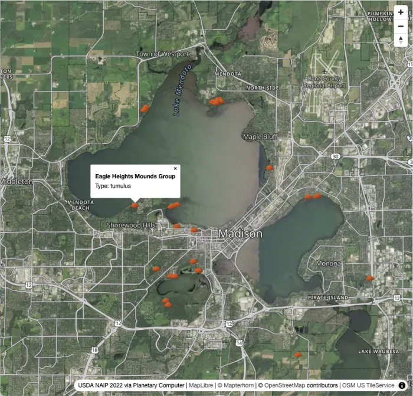
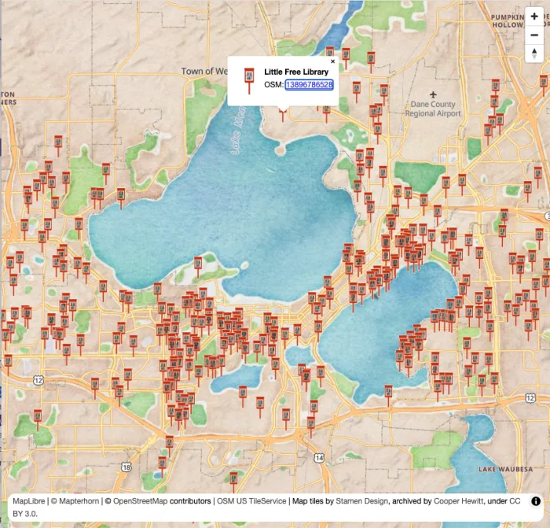

This workshop guides you through turning OpenStreetMap data into a working web map you can share with your community using only open tools and infrastructure you control.

## What You'll Build

A web map of Madison, WI built from scratch with MapLibre GL JS. You'll choose your theme: **Little Free Libraries** or **Effigy Mounds**, and query it live and style it visually with Overpass Ultra, and add it into a basemap you pick (painterly watercolor or USDA aerial imagery). You'll learn how to host your creation for free on GitHub Pages.

<div class="figure-pair">
  <figure>
    
    <figcaption>Effigy Mounds</figcaption>
  </figure>
  <figure>
    
    <figcaption>Little Free Libraries</figcaption>
  </figure>
</div>

---

## Before We Begin: Setup Instructions

Please complete this setup **before the workshop session begins**. This way we can hit the ground running.

If you run into trouble during setup, please reach out to Stephanie May on OpenStreetMap Slack (or find me in person).

### Fork the Repository

The first thing you need to do is **fork the workshop repository**. This gives you a personal copy to edit and publish.

1. Create a [GitHub account](https://github.com/join) if you don't already have one
2. Go to [github.com/mizmay/intro-to-web-maps](https://github.com/mizmay/intro-to-web-maps)
3. Click **Fork** (top right) → **Create fork**
4. Your copy now lives at `github.com/YOUR-USERNAME/intro-to-web-maps`

At the end of the workshop, you'll enable GitHub Pages on your fork and share a live URL: `YOUR-USERNAME.github.io/intro-to-web-maps/`

### Choose Your Path

The additional setup required depends on whether you prefer to work locally on your own machine, and therefore need to install software and dependancies, or whether you are fine using a virtual machine in the cloud.

**Path A: GitHub Codespaces.** Everything runs in a cloud-hosted development environment in your browser with everything pre-installed. No installs required beyond the GitHub account you just used to fork. This is the recommended option for beginners.

**Path B: Local Setup.** Everything runs on your own machine. Requires developer tools (Git, Caddy, VS Code). Choose this if you prefer to work from your laptop or want to continue using the project after the workshop without relying on a GitHub cloud environment.

---

### Path A: GitHub Codespaces

GitHub Codespaces gives you a full VS Code-like development environment in your browser. Caddy and the PMTiles CLI are pre-configured in the repository's devcontainer; nothing to install.

1. On your fork, click **Code** → **Codespaces** tab → **Create codespace on main**
2. Wait for the environment to build (about 1–2 minutes on first launch)
3. A VS Code-like editor opens in your browser with the repo pre-loaded
4. There should be a command line in the terminal window in the bottom panel. If not, go to **Terminal** menu → **New Terminal** (or press `` Ctrl+` ``)
5. At the command line in the terminal, type:

```bash
caddy run
```

6. A notification may appear asking whether to open the forwarded port. Click **Open in Browser**. You should see NAIP aerial imagery of the Madison area with terrain hillshade. That's `index.html` pre-loaded with the imagery basemap. You're all set for the workshop.

**Verification checklist:**
- Codespace launches without errors
- `caddy run` starts without errors
- Imagery basemap loads in the browser tab that opens from the forwarded port

---

### Path B: Local Setup

You need three tools installed on your machine. Several steps below require a **terminal**: a text-based window where you type commands and press Enter to run them.

- **macOS:** Open the **Terminal** app. Find it in Applications → Utilities, or press `Cmd+Space` and search "Terminal."
- **Windows:** Open **Command Prompt** or **PowerShell**. Press the Windows key, type "cmd" or "powershell," and press Enter.
- **Linux:** Open your distro's terminal emulator. Right-click the desktop and look for "Open Terminal," or search your app launcher.

Once VS Code is installed, you can use its **built-in terminal** instead: open it with **Terminal** menu → **New Terminal** (or `` Ctrl+` ``). The verification steps at the end of this section assume you're using VS Code's integrated terminal.

#### 1. Git

**macOS:** Open Terminal and run:

```bash
git --version
```

If Git isn't installed, macOS will prompt you to install Xcode Command Line Tools. Accept it.

**Windows:** Download and install [Git for Windows](https://git-scm.com/download/win). Accept all defaults.

**Linux (Debian/Ubuntu):**

```bash
sudo apt install git
```

**Verify:**

```bash
git --version
# git version 2.x.x
```

#### 2. VS Code (or another code editor)

You'll be editing `index.html` during the workshop. Any text editor works, but VS Code is recommended. It matches the interface you see in Codespaces.

Download: [code.visualstudio.com](https://code.visualstudio.com/)

#### 3. Caddy Web Server

Caddy serves your map files locally. We use Caddy instead of Python or Node because the workshop uses PMTiles for terrain tiles. PMTiles relies heavily on HTTP byte-range requests. While Python and Node can do this, Caddy handles production-grade range requests, caching, and CORS headers out of the box with a simple, one-line configuration.

**macOS (Homebrew):**

```bash
brew install caddy
```

**macOS (without Homebrew):** Download from [caddyserver.com/docs/install](https://caddyserver.com/docs/install)

**Windows:** Download the `.exe` from [caddyserver.com/docs/install](https://caddyserver.com/docs/install) and add it to your PATH. The install page has step-by-step instructions. If you are uncertain or lack permissions, consult your domain administrator.

**Linux (Debian/Ubuntu):**

```bash
sudo apt install -y debian-keyring debian-archive-keyring apt-transport-https curl
curl -1sLf 'https://dl.cloudsmith.io/public/caddy/stable/gpg.key' | sudo gpg --dearmor -o /usr/share/keyrings/caddy-stable-archive-keyring.gpg
curl -1sLf 'https://dl.cloudsmith.io/public/caddy/stable/debian.deb.txt' | sudo tee /etc/apt/sources.list.d/caddy-stable.list
sudo apt update
sudo apt install caddy
```

**Verify:**

```bash
caddy version
# v2.x.x
```

#### 4. Clone and Open Your Fork

**Using VS Code (no terminal needed for this step):**

1. Open VS Code. You should see "Clone Git repository..." on the welcome screen. Click that, or if you don't see it:
    - Press `Cmd+Shift+P` (macOS) or `Ctrl+Shift+P` (Windows/Linux) to open the Command Palette
    - Type **Git: Clone** and press Enter
2. Paste your fork URL: `https://github.com/YOUR-USERNAME/intro-to-web-maps`
3. Choose a folder on your machine, then click **Open Repository** when prompted

**Using a terminal:**

```bash
git clone https://github.com/YOUR-USERNAME/intro-to-web-maps
cd intro-to-web-maps
code .
```

### Optional: PMTiles CLI

The PMTiles CLI lets you extract terrain and raster tiles for any area. It's already installed in Codespaces. For local setup it's optional; terrain tiles for the workshop are already included in the repo. Install it if you want to extract tiles for your own area after the workshop.

**macOS (Homebrew):**

```bash
brew install pmtiles
```

**All platforms:** Download a binary from [github.com/protomaps/go-pmtiles/releases](https://github.com/protomaps/go-pmtiles/releases)

**Verify:**

```bash
pmtiles version
```

#### Path B Verification Checklist

1. Open VS Code's integrated terminal: **Terminal** menu → **New Terminal** (or press `` Ctrl+` ``)
2. Check your tools:

```bash
git --version     # git version 2.x.x or higher
caddy version     # v2.x.x
```

3. Start the local server from the `intro-to-web-maps` folder:

```bash
caddy run
```

4. Open [http://127.0.0.1:1234/](http://127.0.0.1:1234/) in your browser. You should see NAIP aerial imagery of the Madison area with terrain hillshade. That's `index.html` pre-loaded with the imagery basemap. You're all set for the workshop.

---

## Workshop Steps

Once you've completed setup, you're ready for the session. Here's what we'll build:

- [**Step 1: Verify Setup + Preview Basemaps**](step-01/): Open the map, read the initialization code, and choose your basemap
- [**Step 2: Extract + Style Data**](step-02/): Query your dataset from OSM and style it in Overpass Ultra
- [**Step 3: Add Data Layer + Popup**](step-03/): Add your styled data to the map with a click popup
- [**Step 4: Swap in Custom Icons**](step-04/): Replace the circles with custom SVG markers
- [**Step 5: Publish to GitHub Pages**](step-05/): Enable Pages on your fork and share a live URL

---

## About This Workshop

**SotM US 2026** · Thursday, June 11 · 3:45–5:00 pm CDT  
University Room A/B/C

Presented by [Stephanie May](https://github.com/mizmay). Source: [github.com/mizmay/intro-to-web-maps](https://github.com/mizmay/intro-to-web-maps).

---

## Questions?

If you have trouble with setup, open an issue on [github.com/mizmay/intro-to-web-maps](https://github.com/mizmay/intro-to-web-maps) or bring your laptop to the session early.

---

**[Next: Step 1: Verify Setup](step-01/)**
